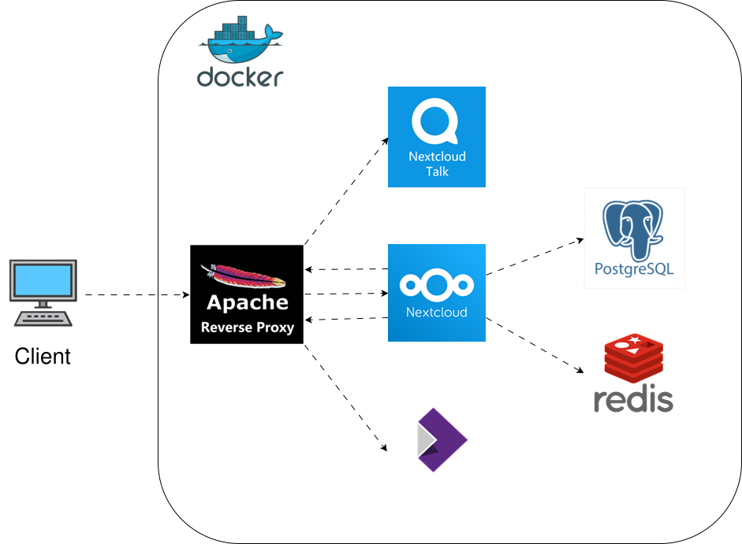

## Overview
This repository is a docker compose based setup for nextcloud along with 
* Collabora (for web based document editing support) 
* Redis caching
* Nextcloud talk 
* Apache reverse proxy



## Docker instructions
* command to run docker compose - `docker compose -f .\nextcloud.yaml up -d --build`
* command to run container named app inside docker compose - `docker compose -f .\nextcloud.yaml up -d --build app`
* config file location in nextcloud docker container - `/var/www/html/config/config.php`
* access docker container as `www-data` user to run php occ commands - `docker exec -it -u www-data app bash`

## Steps to run
* Create `db.env` and `.env` files

* Add the following dns entries in hosts file (since we are not using a real public domain)
```bash
127.0.0.1 nextcloud.local
127.0.0.1 collabora.local
127.0.0.1 signal.local
```
hosts file in windows is located at `C:\Windows\System32\drivers\etc\hosts`
hosts file in debian is located at `/etc/hosts`

* Run the whole docker compose with `docker compose -f 'nextcloud.yaml' up -d --build`

    * Create self signed SSLs by running `omgwtfssl`, `omgwtfssl2`, `omgwtfssl3` containers
    ```bash
    docker compose -f self_signed_certs_gen.yaml up -d --build omgwtfssl
    docker compose -f self_signed_certs_gen.yaml up -d --build omgwtfssl2
    docker compose -f self_signed_certs_gen.yaml up -d --build omgwtfssl3
    ```
    * For a CA-issued certificate, skip the self-signed generators and instead save the valid cert/key/chain into the `certs` folder.
      Also set `SKIP_CERT_VERIFY=false` in `.env` so services require trusted certificate verification.

    * Run `collabora` container (for nextcloud office online editor)
    ```bash
    docker compose -f nextcloud.yaml up -d --build collabora
    ```

    * Run `nc-talk` container (for nextcloud talk high performance backend)
    ```bash
    docker compose -f nextcloud.yaml up -d --build nc-talk
    ```

    * Run `proxy` container (reverse proxy for nextcloud)
    ```bash
    docker compose -f nextcloud.yaml up -d --build proxy
    ```

    * Run `app` container (nextcloud)
    ```bash
    docker compose -f nextcloud.yaml up -d --build app
    ```
* If the post-installation scripts could not run correctly due to some reason, they can be run again using the following scripts

```batch
docker exec -u www-data -i app sh < .\nextcloud\appHooks\post-installation\00_indicate_rev_proxy_https.sh
docker exec -u www-data -i app sh < .\nextcloud\appHooks\post-installation\01_install_apps.sh
```

To run script from Linux based workstations, use the following commands instead
```bash
docker exec -u www-data -i app sh < ./nextcloud/appHooks/post-installation/00_indicate_rev_proxy_https.sh
docker exec -u www-data -i app sh < ./nextcloud/appHooks/post-installation/01_install_apps.sh
```

## run cron nextcloud cron job
* run `docker exec -u www-data app php /var/www/html/cron.php` every 5 mins so that cron.php is run the machine running the nextcloud docker container
* Run `sudo crontab -e -u www-data` and add the line `*/5 * * * * docker exec -u www-data app php /var/www/html/cron.php`

## Run database backup
### Setup pgbackrest
* If required manually start the backup container using
```sh
docker compose -f nextcloud.yaml up -d --build pgbackrest
```

* Initialize the pgbackrest stanza in the backup folder
```sh
docker exec -it pg_backup_runner pgbackrest --stanza=main --no-online stanza-create
```

* check if pgbackrest is able to authenticate with db
```sh
docker exec -it pg_backup_runner pgbackrest --stanza=main check
``` 
### Backup db
* The following shell script performs a daily incremental and weekly full backup of the db. This script can be run as a daily cron job (Example daily 1 AM cron `0 1 * * * /path/to/run_backup.sh`)

```sh
#!/bin/bash
set -e

CONTAINER_NAME="pg_backup_runner"
STANZA_NAME="main"

# Create log directory and timestamped file name
LOG_DIR="/var/log/pgbackrest"
mkdir -p "$LOG_DIR"
LOG_FILE="${LOG_DIR}/backup_$(date +%Y-%m-%d_%H-%M-%S).log"

DAY_OF_WEEK=$(date +%u)

echo "=== Backup Started at $(date) ===" > "$LOG_FILE"

# Determine backup type
if [ "$DAY_OF_WEEK" -eq 7 ]; then
    BACKUP_TYPE="full"
    echo "📅 Sunday detected. Triggering WEEKLY FULL backup..." >> "$LOG_FILE"
else
    BACKUP_TYPE="incr"
    echo "📅 Weekday detected. Triggering DAILY INCREMENTAL backup..." >> "$LOG_FILE"
fi

# Execute backup
if docker exec "$CONTAINER_NAME" pgbackrest --stanza="$STANZA_NAME" --type="$BACKUP_TYPE" backup >> "$LOG_FILE" 2>&1; then
    echo "✅ Backup ($BACKUP_TYPE) completed successfully at $(date)." >> "$LOG_FILE"
else
    echo "❌ ERROR: Backup ($BACKUP_TYPE) failed!" >> "$LOG_FILE"
    exit 1
fi

# Clean up local logs older than 30 days
find "$LOG_DIR" -name "backup_*.log" -type f -mtime +30 -delete
``` 

### List all backups
```sh
docker exec pg_backup_runner pgbackrest --stanza=main info
```

The output will look similar to:
```
stanza: main
    status: mixed
    
    db (current)
        wal archive min/max (16): 000000010000000000000001 / 00000001000000000000000F

        full backup: 20260621-010000F
            timestamp start/stop: 2026-06-21 01:00:00 / 2026-06-21 01:05:22
            wal info: min/max (16): 000000010000000000000002 / 000000010000000000000004
            size: 4.2GB, repo size: 1.1GB

        incr backup: 20260621-010000F_20260622-010000I
            timestamp start/stop: 2026-06-22 01:00:00 / 2026-06-22 01:01:10
            wal info: min/max (16): 000000010000000000000005 / 000000010000000000000005
            size: 154MB, repo size: 12MB
```

The text strings like 20260621-010000F or 20260621-010000F_20260622-010000I are our Unique Backup IDs.

### Restore specific bcakup using its ID
* Append the `--set=` parameter followed by a chosen Backup ID to restore the database to a specific snapshot in time

```sh
docker exec -it pg_backup_runner pgbackrest \
  --stanza=main \
  --set=20260621-010000F_20260622-010000I \
  delta \
  restore
```

### Restore db

```sh
#!/bin/bash
set -e

# Accept the first script argument as the target backup ID
TARGET_BACKUP=$1

echo "=========================================================="
echo "🚨 NEXTCLOUD DISASTER RECOVERY UTILITY 🚨"
echo "=========================================================="

# 1. Display available options
echo "📚 Fetching available backups from NAS storage..."
echo "----------------------------------------------------------"
docker exec pg_backup_runner pgbackrest --stanza=main info
echo "----------------------------------------------------------"

if [ -z "$TARGET_BACKUP" ]; then
    echo "💡 No target ID specified. Restoring the LATEST available backup."
    RESTORE_FLAGS="--log-level-console=info delta restore"
else
    echo "🎯 Specific Target Requested: $TARGET_BACKUP"
    RESTORE_FLAGS="--set=$TARGET_BACKUP --log-level-console=info delta restore"
fi

read -p "⚠️ Proceed with data overwrite? (y/N): " CONFIRM
if [[ ! "$CONFIRM" =~ ^[Yy]$ ]]; then
    echo "❌ Restore cancelled."
    exit 0
fi

echo "⏱️ 1. Stopping 'db' container..."
docker compose stop db

echo "🧹 2. Wiping target data directory..."
docker compose run --rm --entrypoint bash pgbackrest -c "rm -rf /var/lib/postgresql/18/docker/*"

echo "📥 3. Restoring requested backup blocks from NAS..."
docker exec -it pg_backup_runner pgbackrest --stanza=main $RESTORE_FLAGS

echo "⚡ 4. Restarting 'db' container..."
docker compose start db

# Automated Health Check Layer
echo "🔍 5. Initiating database cluster health verification..."
MAX_ATTEMPTS=10
ATTEMPT=1
DB_READY=0

while [ $ATTEMPT -le $MAX_ATTEMPTS ]; do
    echo "   ⏳ Checking if database port is accepting connections... (Attempt $ATTEMPT/$MAX_ATTEMPTS)"
    if docker exec db pg_isready -U nextcloud -d nextcloud > /dev/null 2>&1; then
        DB_READY=1
        break
    fi
    sleep 3
    ATTEMPT=$((ATTEMPT + 1))
done

if [ $DB_READY -eq 0 ]; then
    echo "❌ ERROR: Database engine failed to start up in time!"
    exit 1
fi

echo "   📋 Executing table readability check..."
if docker exec db psql -U nextcloud -d nextcloud -c "SELECT 'Core DB Access OK' AS status;" > /dev/null 2>&1; then
    echo "=========================================================="
    echo "✅ SUCCESS: Nextcloud database restored and fully healthy! ✅"
    echo "=========================================================="
else
    echo "⚠️ WARNING: Database port is open, but connection validation failed!"
    exit 1
fi
```

## Tips
* Add trusted domains in Nextcloud with occ command
```bash
php occ config:system:set trusted_domains 2 --value=nextcloud.local
php occ config:system:set trusted_domains 3 --value=192.168.0.3
```

## .env file
```bash
NEXTCLOUD_FQDN=nextcloud.local
NEXTCLOUD_UNAME=admin
NEXTCLOUD_PWD=learning
COLLABORA_FQDN=collabora.local
COLLABORA_UNAME=admin
COLLABORA_PWD=collaborapwd
SIGNAL_FQDN=signal.local
TURN_SECRET=secretpassword
SIGNALING_SECRET=secretpassword
INTERNAL_SECRET=secretpassword
# set to "true" for local self-signed certificates, or "false" when using a CA-issued valid SSL certificate
SKIP_CERT_VERIFY=true
```

## db.env file
```bash
POSTGRES_DB=nextcloud
POSTGRES_USER=nextcloud
POSTGRES_PASSWORD=learningsoftware

# pgBackRest Global & Retention Settings
PGBACKREST_STANZA=main
PGBACKREST_REPO1_PATH=/var/lib/pgbackrest
PGBACKREST_REPO1_RETENTION_FULL=2
PGBACKREST_COMPRESS_TYPE=lz4
PGBACKREST_LOG_LEVEL_CONSOLE=info

# Pure Pull-Based Network Configurations
PGBACKREST_PG1_TYPE=pg
PGBACKREST_PG1_HOST=db
PGBACKREST_PG1_PATH=/var/lib/postgresql/18/docker
PGBACKREST_PG1_USER=${POSTGRES_USER}
PGBACKREST_PG1_DATABASE=${POSTGRES_DB}

# Retain exactly 13 full backups (13 weeks * 7 days = 91 days of history)
PGBACKREST_REPO1_RETENTION_FULL=13
```

## References
* Nextlcoud `occ` command docs - https://docs.nextcloud.com/server/stable/admin_manual/configuration_server/occ_command.html#using-the-occ-command
* Nextcloud docker setup blog - https://help.nextcloud.com/t/howto-ubuntu-docker-nextcloud-talk-collabora/76430
* Official docker nextcloud GitHub repo - https://github.com/nextcloud/docker
* Run user defined scripts in nextcloud docker image using hook scripts - https://github.com/nextcloud/docker?tab=readme-ov-file#auto-configuration-via-hook-folders
* nextcloud collabora integration guide - https://help.nextcloud.com/t/collabora-integration-guide/151879
* nextcloud talk occ commands - https://nextcloud-talk.readthedocs.io/en/latest/occ/
